<h1 align="center">Hi, I'm Isaac 👋</h1>

  I build practical software and explore machine learning, computer graphics, 
  statistical modelling, and developer tooling.

  
  

### GitHub at a glance

 

### Languages and tools

  
  
  
  
  
  
  
  
  
  

### What I'm working on

- Applying machine learning and statistical modelling to real datasets.
- Learning graphics and systems programming through [Metal/C++](https://github.com/Isaac7777-cpu/learning-metal-cpp-game-engine), [Zig](https://github.com/Isaac7777-cpu/zig-asteroids), and [Rust](https://github.com/Isaac7777-cpu/zero-to-prod-rust).
- Building and refining developer tools for [Neovim](https://github.com/Isaac7777-cpu/nvim-config) and the terminal.

These cards are refreshed daily by GitHub Actions.
